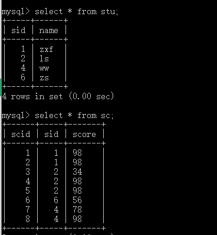
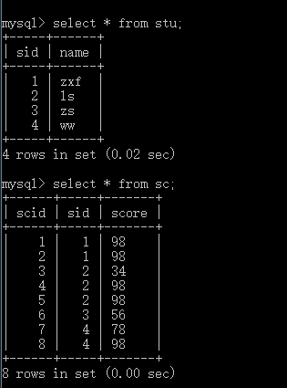

# mysql的级联操作

## 创建两张表格

```sql
create table stu(
sid int unsigned primary key auto_increment,
name varchar(20) not null
);

create table sc(
scid int unsigned primary key auto_increment,
sid int unsigned not null,
score varchar(20) default '0',
index(sid),
foreign key (sid) references stu(sid) on delete cascade on update cascade
);
```

## 插入数据

```sql
insert into stu (name) value ('zxf');
insert into stu (name) value ('ls');
insert into stu (name) value ('zs');
insert into stu (name) value ('ww');

insert into sc(sid,score) values ('1','98');
insert into sc(sid,score) values ('1','98');
insert into sc(sid,score) values ('2','34');
insert into sc(sid,score) values ('2','98');
insert into sc(sid,score) values ('2','98');
insert into sc(sid,score) values ('3','56');
insert into sc(sid,score) values ('4','78');
insert into sc(sid,score) values ('4','98');
```

展示：<br/>


## 级联操作

```sql
update stu set sid = 3 where sid = 6;
```

展示：<br/>

