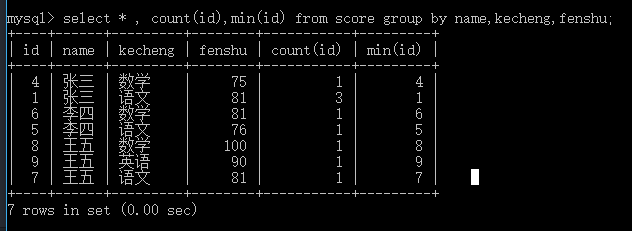

# you idea

**Do not,for one repulse,give up the purpose that you resolved to effect.**

## create database

```sql
create database mydatabase;
use mydatabase;
show tables;
```

## create tables

``` sql
 create table score(
id int not null,
name varchar(255),
kecheng varchar(255),
fenshu int,
primary key(id)
)
```

## insert data to tables

```sql
insert into score (name,kecheng,fenshu) values('张三','语文',81);
insert into score (name,kecheng,fenshu) values('张三','数学',75);
insert into score (name,kecheng,fenshu) values('李四','语文',76);
insert into score (name,kecheng,fenshu) values('李四','数学',81);
insert into score (name,kecheng,fenshu) values('王五','语文',81);
insert into score (name,kecheng,fenshu) values('王五','数学',100);
insert into score (name,kecheng,fenshu) values('王五','英语',90);
```

## alter table

```sql
alter table score change id id int not null auto_increment;
```

## 每门课分数都大于80

> ### 用一条SQL 语句 查询出每门课都大于80 分的学生姓名 <br/>
> way:1 查询学生分数小于80的同学，然后判断 != 小于80 的同学<br/>
> way:2 以name 分组 最小分数大于 80

```sql
 select distinct name from score where name not in(select distinct name from score where fenshu< 80);
 select distinct name from score group by name having min(fenshu)>80;
```

## 删除冗余信息

> ### 删除自动编号不同，其他都相同的学生冗余信息

<!-- <div align=center> -->
example:</br>


```sql
    -- 查询单列表重复
select * from score where name in (select name from score group by name having count(name)>1);
    -- 查询多列表重复
select a.* from score a,(select select name,fenshu from score group by name, fenshu having count(1)>1) as b where a.name= b.name and a.fenshu = b.fenshu;
    -- answer
delete score where id not in(select min(id) from score where
group by name,kecheng,fenshu);
```

## 习题1

**有一张表，里面有3个字段：语文，数学，英语。其中有3条记录分别表示语文70分，数学80分，英语58分，请用一条sql语句查询出这三条记录并按以下条件显示出来（并写出您的思路）:<br/>大于或等于80表示优秀，大于或等于60表示及格，小于60分表示不及格,显示如下：**<br/>

语文 | 数学 | 英语

- | :-: | -:

及格 | 优秀 | 不及格

```sql
select
(case when 语文>=80 then '优秀' when 语文>=60 then '及格' else '不及格') as 语文,
(case when 数学>=80 then '优秀' when 数学>=60 then '及格' else '不及格') as 数学,
(case when 英语>=80 then '优秀' when 英语>=60 then '及格' else '不及格') as 英语,
from table
```

## 习题2

1. 创建一张学生表，包含一下信息，学号，姓名，年龄，性别，家庭，住址，联系电话
2. 修改学生表的结构，添加一列信息，学历
3. 修改学生表结构，删除一列信息，家庭住址
4. 向学生表中添加如下信息:
5. 修改学生表的数据，将电话号码以11开头的学员的学历改为“大专”
6. 删除学生表的数据，姓名以C开头，性别为‘男’的记录删除
7. 查询学生表的数据，将所有年龄小于22岁的，学历为“大专”的，学生的姓名和学号示出来
8. 查询学生表的数据，查询所有信息，列出前25%的记录
9. 查询出所有学生的姓名，性别，年龄降序排列
10. 按照性别分组查询所有的平均年龄

学号 | 姓名 | 年龄 | 性别 | 联系电话 | 学历
:-: | :-: | :-: |:-: |:-: | -:
1 | A | 22 | man | 123456 | 小学
2 | B | 21 | man | 119    | 中学
3 | C | 24 | man | 120    | 高中
4 | D | 18 | female | 114 | 大学
