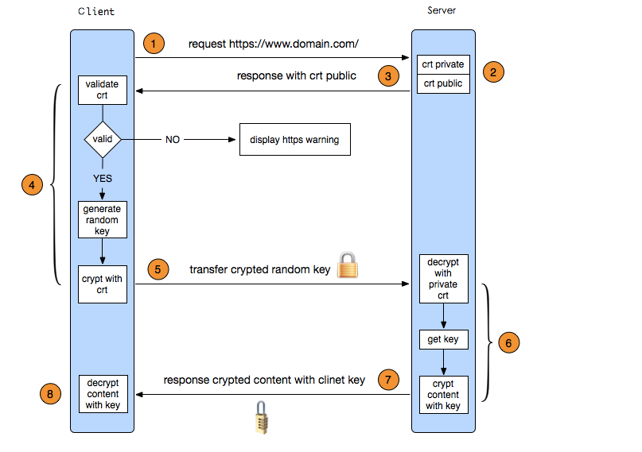
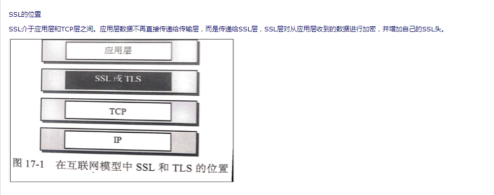
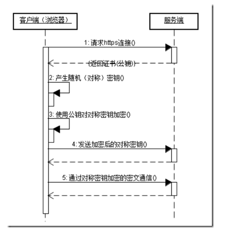

# https

## https 简介

> HTTPS其实是有两部分组成：HTTP + SSL / TLS，也就是在HTTP上又加了一层处理加密信息的模块。服务端和客户端的信息传输都会通过TLS进行加密，所以传输的数据都是加密后的数据。具体是如何进行加密，解密，验证的,如图

## 客户端发起HTTPS请求

> 就是用户在浏览器里输入一个https网址，然后连接到server的443端口

## 服务端的配置

> 采用HTTPS协议的服务器必须要有一套数字证书，可以自己制作，也可以向组织申请。区别就是自己颁发的证书需要客户端验证通过，才可以继续访问，而使用受信任的公司申请的证书则不会弹出提示页面(startssl就是个不错的选择，有1年的免费服务)。这套证书其实就是一对公钥和私钥。如果对公钥和私钥不太理解，可以想象成一把钥匙和一个锁头，只是全世界只有你一个人有这把钥匙，你可以把锁头给别人，别人可以用这个锁把重要的东西锁起来，然后发给你，因为只有你一个人有这把钥匙，所以只有你才能看到被这把锁锁起来的东西。

## 传送证书

> 这个证书其实就是公钥，只是包含了很多信息，如证书的颁发机构，过期时间等等。

## 客户端解析证书

> 这部分工作是有客户端的TLS来完成的，首先会验证公钥是否有效，比如颁发机构，过期时间等等，如果发现异常，则会弹出一个警告框，提示证书存在问题。如果证书没有问题，那么就生成一个随即值。然后用证书对该随机值进行加密。就好像上面说的，把随机值用锁头锁起来，这样除非有钥匙，不然看不到被锁住的内容。

## 传送加密信息

> 服务端用私钥解密后，得到了客户端传过来的随机值(私钥)，然后把内容通过该值进行对称加密。所谓对称加密就是，将信息和私钥通过某种算法混合在一起，这样除非知道私钥，不然无法获取内容，而正好客户端和服务端都知道这个私钥，所以只要加密算法够彪悍，私钥够复杂，数据就够安全。

## 服务段解密信息

> 服务端用私钥解密后，得到了客户端传过来的随机值(私钥)，然后把内容通过该值进行对称加密。所谓对称加密就是，将信息和私钥通过某种算法混合在一起，这样除非知道私钥，不然无法获取内容，而正好客户端和服务端都知道这个私钥，所以只要加密算法够彪悍，私钥够复杂，数据就够安全。

## 传输加密后的信息

> 这部分信息是服务段用私钥加密后的信息，可以在客户端被还原

## 客户端解密信息

> 客户端用之前生成的私钥解密服务段传过来的信息，于是获取了解密后的内容。整个过程第三方即使监听到了数据，也束手无策。

HTTPS在传输数据之前需要客户端（浏览器）与服务端（网站）之间进行一次握手，在握手过程中将确立双方加密传输数据的密码信息。TLS/SSL协议不仅仅是一套加密传输的协议，更是一件经过艺术家精心设计的艺术品，TLS/SSL中使用了非对称加密，对称加密以及HASH算法。握手过程的具体描述如下：

1. 浏览器将自己支持的一套加密规则发送给网站。

2. 网站从中选出一组加密算法与HASH算法，并将自己的身份信息以证书的形式发回给浏览器。证书里面包含了网站地址，加密公钥，以及证书的颁发机构等信息。 

3. 浏览器获得网站证书之后浏览器要做以下工作
* 验证证书的合法性（颁发证书的机构是否合法，证书中包含的网站地址是否与正在访问的地址一致等），如果证书受信任，则浏览器栏里面会显示一个小锁头，否则会给出证书不受信的提示。
* 如果证书受信任，或者是用户接受了不受信的证书，浏览器会生成一串随机数的密码，并用证书中提供的公钥加密。
* 使用约定好的HASH算法计算握手消息，并使用生成的随机数对消息进行加密，最后将之前生成的所有信息发送给网站。

4.网站接收浏览器发来的数据之后要做以下的操作:

* 使用自己的私钥将信息解密取出密码，使用密码解密浏览器发来的握手消息，并验证HASH是否与浏览器发来的一致。

* 使用密码加密一段握手消息，发送给浏览器。

5.浏览器解密并计算握手消息的HASH，如果与服务端发来的HASH一致，此时握手过程结束，之后所有的通信数据将由之前浏览器生成的随机密码并利用对称加密算法进行加密。

## 加密方式

这里浏览器与网站互相发送加密的握手消息并验证，目的是为了保证双方都获得了一致的密码，并且可以正常的加密解密数据，为后续真正数据的传输做一次测试。另外，HTTPS一般使用的加密与HASH算法如下：

* 非对称加密算法：RSA，DSA/DSS

* 对称加密算法：AES，RC4，3DES

* HASH算法：MD5，SHA1，SHA256

## 总结

服务器 用RSA生成公钥和私钥

把公钥放在证书里发送给客户端，私钥自己保存

客户端首先向一个权威的服务器检查证书的合法性，如果证书合法，客户端产生一段随机数，这个随机数就作为通信的密钥，我们称之为对称密钥，用公钥加密这段随机数，然后发送到服务器

服务器用密钥解密获取对称密钥，然后，双方就已对称密钥进行加密解密通信了

### copy from url

[传送门1：https://www.cnblogs.com/jtlgb/p/6760679.html](https://www.cnblogs.com/jtlgb/p/6760679.html)

[传送门2：http://www.cnblogs.com/ttltry-air/archive/2012/08/20/2647898.html](http://www.cnblogs.com/ttltry-air/archive/2012/08/20/2647898.html)

